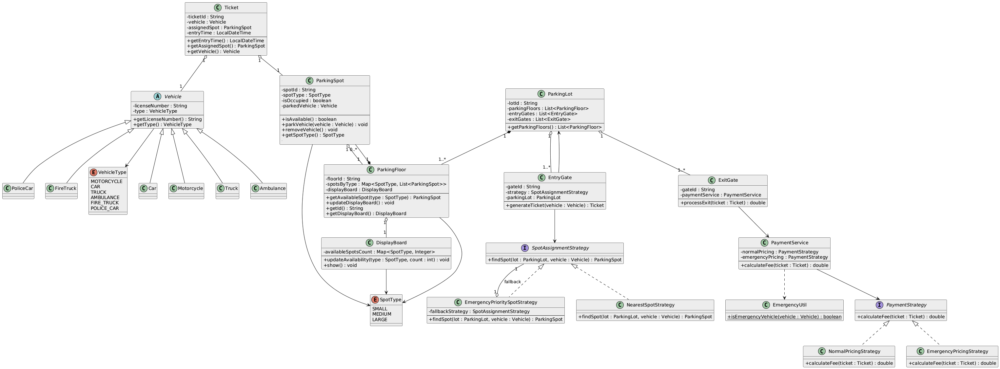

# 🚗 Parking Lot Low-Level Design (LLD)

A complete **Parking Lot System** designed using **Object-Oriented Design**,  
**SOLID principles**, **Strategy Pattern**, and clean architectural practices.

---

## 🧱 Overview

This Parking Lot system simulates:

- Assigning parking spots
- Handling multiple floors
- Managing different vehicle types
- Showing real-time availability
- Handling entry & exit gates
- Calculating fees using strategies
- Emergency vehicle priority handling

The architecture is fully extensible without modifying existing classes.

---

## 🎯 Features

### ✔️ Entity Layer (Real-world objects)
- ParkingLot
- ParkingFloor
- ParkingSpot
- Vehicle + Vehicle Types
- Ticket
- DisplayBoard

### ✔️ Behavioral Layer (Logic & workflows)
- EntryGate
- ExitGate
- PaymentService
- SpotAssignmentStrategy
- PaymentStrategy

### ✔️ Strategies Implemented
**Spot Assignment Strategies**
- NearestSpotStrategy  
- EmergencyPrioritySpotStrategy (fallback to Nearest)

**Payment Strategies**
- NormalPricingStrategy  
- EmergencyPricingStrategy (free parking)

---

## 🚗 Supported Vehicle Types

| Vehicle | Spot Type Required |
|---------|--------------------|
| Motorcycle | SMALL |
| Car | MEDIUM |
| Truck | LARGE |
| Ambulance | MEDIUM |
| Police Car | SMALL |
| Fire Truck | LARGE |

---

## 🅿️ Parking Spot Types

- **SMALL**  
- **MEDIUM**  
- **LARGE**

Each floor contains a configurable number of each spot type.

---

## 🏢 System Architecture

The system follows:

- **High Cohesion**
- **Loose Coupling**
- **Composition over Inheritance**
- **Dependency Injection**
- **Strategy Pattern**
- **Open/Closed Principle**

---

## 📦 Class Diagram (UML)

Below is the class diagram representing the relationship between classes:

---

## 🧠 SOLID Principles Used

### ✔ SRP — Single Responsibility  
Each class has one responsibility:
- ParkingSpot → occupancy  
- PaymentService → fee calculation  
- EntryGate → ticket generation  
- ExitGate → exit processing  

### ✔ OCP — Open for Extension, Closed for Modification  
You can add:
- New vehicle types  
- New pricing strategies  
- New spot assignment logic  

…without changing existing classes.

### ✔ LSP — Liskov Substitution  
All vehicle subclasses work wherever Vehicle is accepted.

### ✔ ISP — Interface Segregation  
Small, focused interfaces:
- SpotAssignmentStrategy  
- PaymentStrategy  

### ✔ DIP — Dependency Inversion  
High-level classes depend on abstractions, not implementations.

---

## 🧩 Strategy Pattern Design

### 🅿 SpotAssignmentStrategy
Determines HOW parking spots are selected.

- `NearestSpotStrategy`  
- `EmergencyPrioritySpotStrategy` (wraps the fallback strategy)

### 💰 PaymentStrategy
Determines HOW fees are calculated.

- `NormalPricingStrategy`  
- `EmergencyPricingStrategy`  

Both are selected dynamically at runtime.

---

## 📊 Display Boards

Each floor has a real-time display board that shows:

