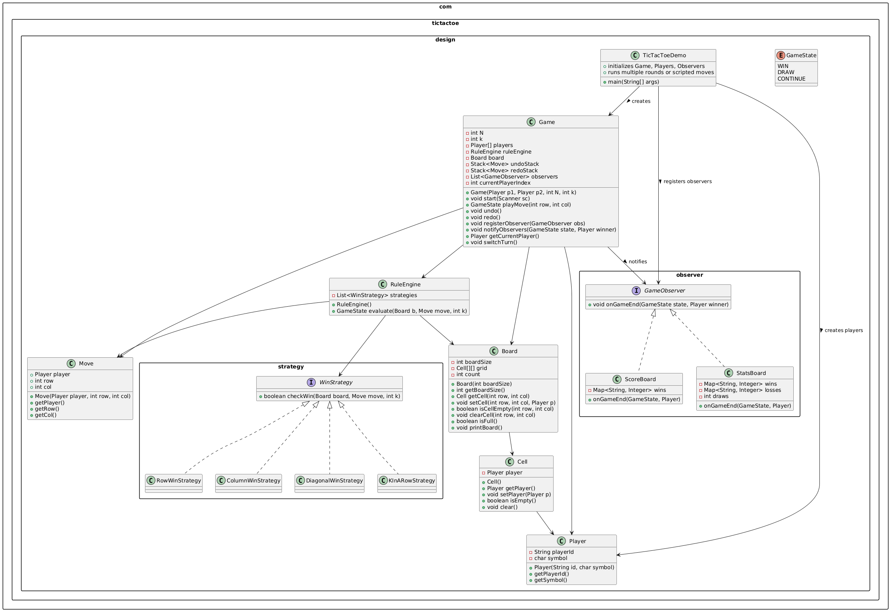
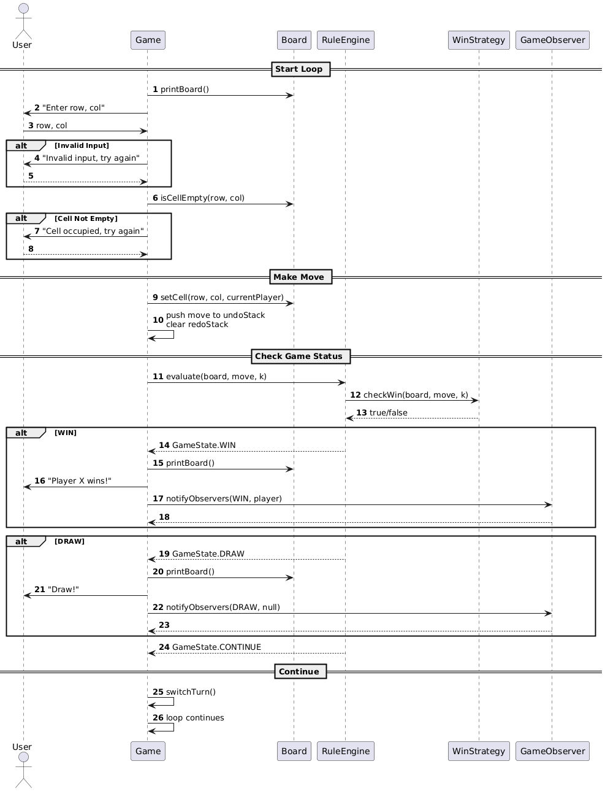

#  Tic-Tac-Toe Game – Low Level Design (Java)

This project implements a **scalable, extensible, pattern-driven Tic-Tac-Toe engine** in Java.

---

# Requirements

## Functional Requirements

* Two players alternate turns.
* Board size **N × N** is configurable.
* Win condition **K consecutive marks** is configurable.
* Validate moves (inside board, empty cell).
* Detect **WIN**, **DRAW**, **CONTINUE**.
* Support **undo** and **redo** operations.
* Multi-round gameplay with a persistent scoreboard.
* Support “scripted” automated test mode.

##  Non-Functional Requirements

* Highly extensible (new rules, new observers, new UIs).
* Low coupling, high cohesion.
* Easy to maintain and test.
* Console-based UI, engine separate from UI.

---

# Architecture Overview

The core engine consists of:

* **Game** – orchestrates the game loop
* **Board / Cell** – internal grid representation
* **Player** – symbol + id
* **Move** – immutable record of a player's action
* **RuleEngine** – evaluates win/draw conditions
* **WinStrategy** – interface for win detection algorithms
* **GameObserver** – implements scoreboard/statistics

---

# Core Classes

### **Board**

Stores grid, updates cells, prints board, and detects “board full”.

### **Cell**

Represents one square on the board (either empty or occupied by a player).

### **Player**

Represents a participant with a unique symbol (X/O or custom).

### **Move**

Immutable object representing a single turn (used for undo/redo).

### **Game**

* Manages turns
* Reads input
* Applies moves
* Maintains undo/redo stacks
* Calls RuleEngine
* Notifies observers
* Supports multiple rounds

### **RuleEngine**

Applies all win-checking strategies to determine the game state.

---

# Design Principles

This system follows **SOLID**:

### SRP

Each class has one responsibility: Board manages grid, RuleEngine checks rules, Game orchestrates flow.

### OCP

Want new win rules? Add a new Strategy class — no changes required elsewhere.

### LSP

Any WinStrategy implementation can replace another.

### ISP

Interfaces like WinStrategy & GameObserver are small and focused.

### DIP

Game depends on abstractions, not concrete implementations.

---

# Design Patterns

## 1. Strategy Pattern (Win Checking)

Different strategies implement:

* RowWinStrategy
* ColumnWinStrategy
* DiagonalWinStrategy
* KInARowStrategy (generic K-in-a-row)

Plug-and-play rules without modifying Game or RuleEngine.

---

## 2. Observer Pattern (Scoreboards, Stats)

Observers listen for game end events:

* ScoreBoard
* StatsBoard

Game sends:

```java
notifyObservers(GameState.WIN, currentPlayer);
```

Observers react independently — great decoupling.

---

##  3. Facade Pattern (TicTacToeDemo)

The `TicTacToeDemo` acts as a façade/driver:

* Initializes Game & Players
* Registers observers
* Starts rounds
* Supports automated testing mode

---

##  4. Command Pattern (Undo/Redo – simplified)

Two stacks:

* `undoStack`
* `redoStack`

Implement redo chaining and backtracking.

---

#  Undo / Redo

### **Undo**

* Pop last move
* Clear board cell
* Push move to redoStack
* Switch turn

### **Redo**

* Pop last undone move
* Reapply move
* Push back to undoStack
* Switch turn

This supports perfect backtracking over moves.

---

# Observers

### **ScoreBoard**

Tracks wins per player across rounds.

### **StatsBoard**

Tracks:

* Wins
* Losses
* Draws

Observers are registered in the Game:

```java
game.registerObserver(scoreboard);
game.registerObserver(statsBoard);
```

---

#  Class Diagram

Below is the class diagram representing the relationship between classes:



---

# 📑 Sequence Diagram – Gameplay

Below is the sequence diagram representing the sequence flow :



---


---

# ▶️ How to Run

### **1. Compile**

```
javac com/tictactoe/design/*.java \
      com/tictactoe/design/observer/*.java \
      com/tictactoe/design/strategy/*.java
```

### **2. Run**

```
java com.tictactoe.design.TicTacToeDemo
```

---

This project demonstrates how even a simple game like Tic-Tac-Toe can become a **rich design exercise** involving:

* Multiple design patterns
* Modular architecture
* Clean APIs
* Extensibility
* Professional LLD thinking

---

You can refer to other Low level designs at https://medium.com/@kavya1234/list/lld-21c82ffd1405


